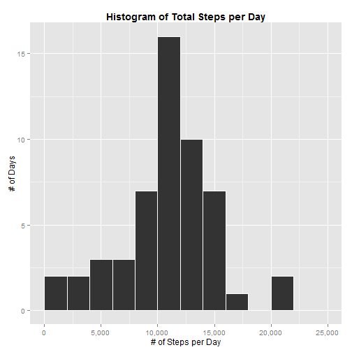
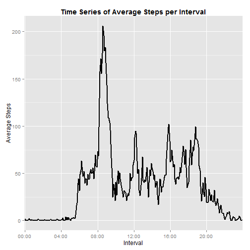
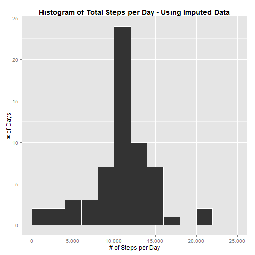
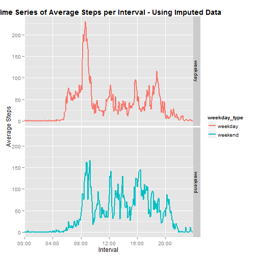

Reproducible Research - Assignment 1
========================================================

This assignment analyzes data from a personal activity monitoring device. The data set contains the number of steps taken in 5 minute intervals between Oct and Nov 2012.


## Loading and preprocessing the data

First, load in the data set. Assumes the file is located in the current working dirctory.

```r
data <- read.csv("activity.csv")
```


Next, adjust the format of the interval field, so that it appears in HH:MM time format.

```r
data$interval <- sprintf("%04d", data$interval)
data$interval <- paste(substr(data$interval, 1, 2), substr(data$interval, 3, 
    4), sep = ":")
```


## What is mean total number of steps taken per day?

Create a histogram of the total steps taken per day. Requires ggplot2, scales & plyr packages.

```r
library(plyr)
library(ggplot2)
library(scales)
steps_by_day <- ddply(data, c("date"), summarise, steps = sum(steps))
ggplot(steps_by_day, aes(x = steps)) + geom_histogram(binwidth = 2000, color = "white") + 
    scale_y_continuous(name = "# of Days") + scale_x_continuous(name = "# of Steps per Day", 
    labels = comma, limits = c(0, 25000)) + ggtitle("Histogram of Total Steps per Day") + 
    theme(plot.title = element_text(lineheight = 0.8, face = "bold"))
```

 


Calculate the mean and median steps per day

```r
mean_steps_per_day <- mean(steps_by_day$steps, na.rm = TRUE)
cat("Mean steps per day is", mean_steps_per_day)
```

```
## Mean steps per day is 10766
```

```r
median_steps_per_day <- median(steps_by_day$steps, na.rm = TRUE)
cat("Median steps per day is", median_steps_per_day)
```

```
## Median steps per day is 10765
```


## What is the average daily activity pattern?

Plot a time seris of average steps by time interval, across all days in our data set

```r
steps_by_interval <- ddply(data, c("interval"), summarise, avg_steps = mean(steps, 
    na.rm = TRUE))
ggplot(steps_by_interval, aes(x = interval, y = avg_steps, group = 1)) + geom_line(size = 1) + 
    scale_x_discrete(name = "Interval", breaks = paste(sprintf("%02d", seq(0, 
        24, 4)), "00", sep = ":")) + scale_y_continuous(name = "Average Steps") + 
    ggtitle("Time Series of Average Steps per Interval") + theme(plot.title = element_text(lineheight = 0.8, 
    face = "bold"))
```

 


Calculate the interval with the maximum average number of steps

```r
max_interval <- steps_by_interval$interval[which.max(steps_by_interval$avg_steps)]
cat("Interval with maximum average steps is", max_interval)
```

```
## Interval with maximum average steps is 08:35
```


## Imputing missing values

Calculate the number of missing values

```r
num_nas <- sum(is.na(data$steps))
cat("Number of records with missing values is", num_nas)
```

```
## Number of records with missing values is 2304
```


Impute missing values into a new data set using the average steps per interval across all days

```r
steps_by_interval <- ddply(data, c("interval"), summarise, avg_steps = mean(steps, 
    na.rm = TRUE))
data_imputed <- merge(data, steps_by_interval, "interval")
data_imputed$steps <- ifelse(is.na(data_imputed$steps), data_imputed$avg_steps, 
    data_imputed$steps)
```


Create a histogram of the total steps taken per day. 

```r
steps_by_day <- ddply(data_imputed, c("date"), summarise, steps = sum(steps))
ggplot(steps_by_day, aes(x = steps)) + geom_histogram(binwidth = 2000, color = "white") + 
    scale_y_continuous(name = "# of Days") + scale_x_continuous(name = "# of Steps per Day", 
    labels = comma, limits = c(0, 25000)) + ggtitle("Histogram of Total Steps per Day - Using Imputed Data") + 
    theme(plot.title = element_text(lineheight = 0.8, face = "bold"))
```

 


Calculate the mean and median steps per day

```r
mean_steps_per_day <- mean(steps_by_day$steps, na.rm = TRUE)
cat("Mean steps per day is", mean_steps_per_day)
```

```
## Mean steps per day is 10766
```

```r
median_steps_per_day <- median(steps_by_day$steps, na.rm = TRUE)
cat("Median steps per day is", median_steps_per_day)
```

```
## Median steps per day is 10766
```


There is not a significant difference in the mean and median steps per day, using the data set with imputed values. Although the distribution of steps per day did not change, the total number of days in the 10,000-12,000 bin of the histogram increased from 16 to 24.

## Are there any differences in activity patterns between weekdays and weekends?

Create a new factor variable indicating weekend/weekday

```r
data_imputed$weekday <- weekdays(as.Date(data_imputed$date))
data_imputed$weekday_type <- as.factor(ifelse(data_imputed$weekday %in% c("Sunday", 
    "Saturday"), "weekend", "weekday"))
```


Create a panel plot of time series by interval, broken out by weekend vs weekday

```r
library(plyr)
library(ggplot2)
library(scales)
steps_by_interval <- ddply(data_imputed, c("interval", "weekday_type"), summarise, 
    avg_steps = mean(steps, na.rm = TRUE))
ggplot(steps_by_interval, aes(x = interval, y = avg_steps, group = weekday_type, 
    color = weekday_type)) + geom_line(size = 1) + facet_grid(weekday_type ~ 
    .) + scale_x_discrete(name = "Interval", breaks = paste(sprintf("%02d", 
    seq(0, 24, 4)), "00", sep = ":")) + scale_y_continuous(name = "Average Steps") + 
    ggtitle("Time Series of Average Steps per Interval - Using Imputed Data") + 
    theme(plot.title = element_text(lineheight = 0.8, face = "bold"))
```

 

